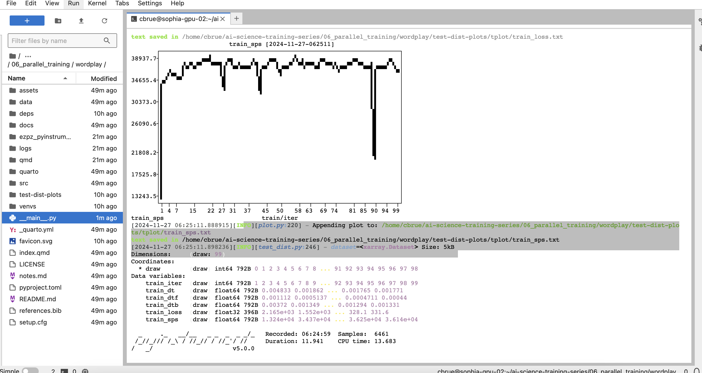
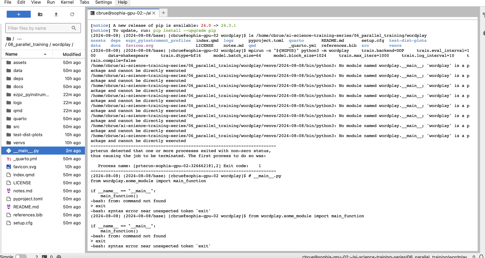

I was able to get the test distriubted training to run , but unable to troubleshoot the wordplay license error described on slack. 

There was a license error in teh installation of wordplay into the environment. 

tried directly insalling wordplay into the environment but got another error instead

