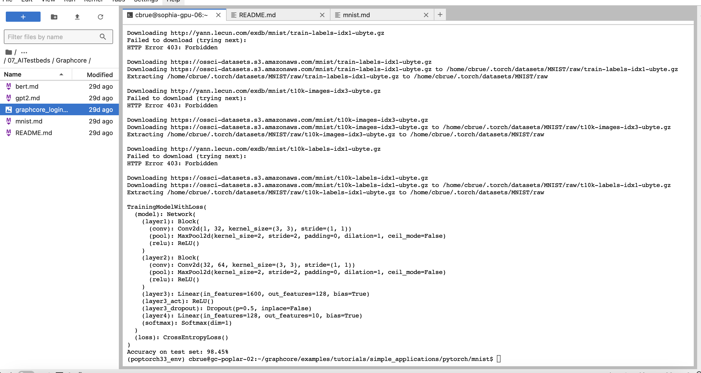
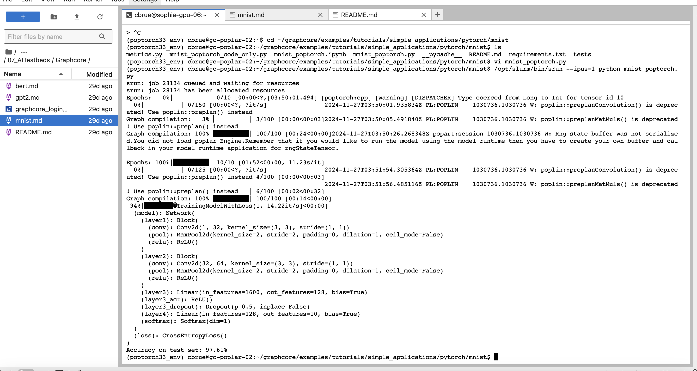
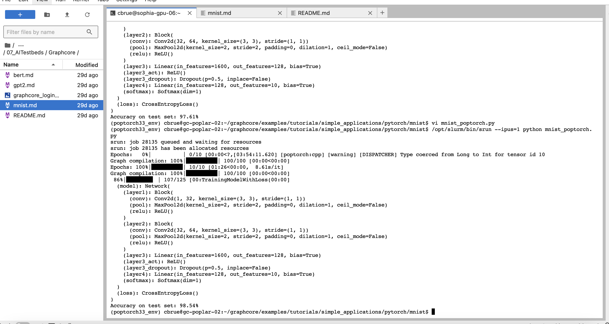
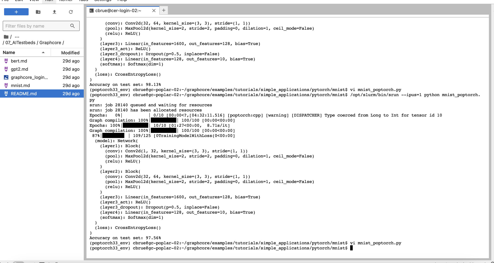

I chose to use the graphcore system for the session 7 assignment. The homework for this hands-on example was to explore batch size, # epocs, and learning rate 

The accuracy from the base config (as written in the example)

The accuracy from increasing the batch size from 8 to 24

The accuracy from lowering the learning rate from 0.003 to 0.001

The accuracy from increaing the number of training epochs from 10 to 30

None of these seem to improve the final training accuracy. So I dropped the learning rate to 0.10 and saw a ~1-2% change in final accuracy which also wasnt dramatically lower.

